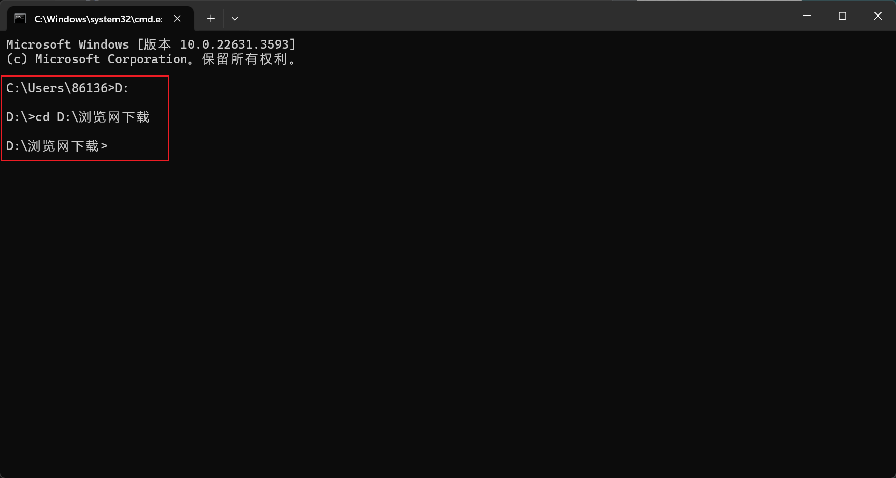
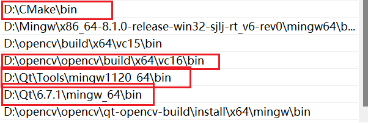
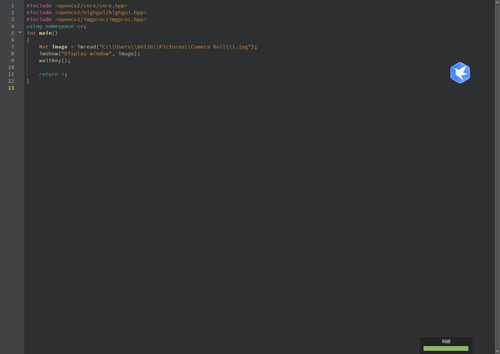

# **Window系统下配置QT6 + opencv**

## 前言
虽然网上有很多教程，但它们通常涉及过时的环境。作为开发者，我们习惯于使用最新的版本。经过一系列的尝试和探索，我们终于成功配置了环境。目前，我和我的一位朋友已经顺利完成了编译。由于我们的样本数量有限，我们不确定在过程中是否会遇到其他问题。如果您在编译过程中遇到问题，欢迎随时咨询我，我会尽力提供帮助。当然，在联系我之前，建议您先在网上搜索相关帖子，看看是否有现成的解决方案
邮箱地址：krivewyh@163.com


## **一、环境介绍**
> 系统：Windows11  
> QT的IDE版本：6.7.1  
> OpenCV版本：4.9.0  
> CMake版本：3.29.3

## **一、Opencv下载**

[opencv下载](https://opencv.org/releases/)


之后打开这个文件，进行opencv源码的解压


自己选择路径进行解压


## **二、CMake下载**

[cmake](https://cmake.org/download/)


### **选择下列版本**


### **选择你的下载路径**


## **三、QT6下载**

[QT下载](https://www.qt.io/download-qt-installer-oss?utm_referrer=https%3A%2F%2Fwww.qt.io%2Fdownload-open-source)


下载windows版本，点击` Qt Online Install for Windows`

<mark>之后选择选择你的下载路径并且记住</mark>
<mark>此时不要打开下载安装，因为Qt目前使用的是国外的源，下载会很慢，有可能失败。</mark>

### **换源具体做法如下：**

打开终端,使用`win+R`,输入`cmd`


进入你的目标文件夹，具体如下：


输入输入 `qt-unified-windows-x64-X.X.X-online.exe --mirror https://mirror.nju.edu.cn/qt` ，
注意将 `qt-unified-windows-x64-X.X.X-online.exe` ，替换成你下载好的Qt下载器的名称

这里我的是`qt-online-installer-windows-x64-4.8.0.exe --mirror https://mirror.nju.edu.cn/qt`

之后安装程序会自动打开

需要登陆或注册一个qt账号


之后就是常规的Qt下载安装了，除了需要下载的组件需要注意外，（组件的下载在后面需要的时候，如果没有下载的，可以再下载），下载安装没什么太多需要注意的。

这里我选择的是


最后不断点击下一步就可以了，


## **四、配置环境变量**
打开系统设置


<mark>添加以下地址到环境变量中，这些地址需要你们自己去寻找自己文件夹地址进行替换</mark>



## 五、CMake编译opencv库并生成

<mark>这一步是最关键的</mark>

### Step1. 初步配置


设置好后点击 `Configure`


选择qt自带的编译器MinGW的`gcc`和`g++`


路径范例为

`D:\Qt\Tools\mingw1120_64\bin\gcc.exe`
`D:\Qt\Tools\mingw1120_64\bin\g++.exe`

点击 Finish
经过漫长的等待后，应该是能够编译成功的。

### **Step2. 排查错误**

以下是我的保错（仅供参考）


以下报错分别为248，144，54 

首先解决第54，144的信息的报错

取消勾选下面这一条，这个是路径错误的警告，取消勾选不会影响软件的运行


接下来解决248的报错
`CMake` 编译 `opencv` 时无法连接服务器，导致下载 `ffmpeg.dll`、`ippicv` 等 发生失败报错

248的报错是来源于，GitHub是国外的网站，前期试了多种方法，比如梯子和更改电脑上网ip都没有解决，最后找到现在这种，修改下载的网站利用代理下载才成功解决

[代理网站](https://ghproxy.com/)

#### **解决方案**

1. 找到目标文件夹`F:\opencv\sources\3rdparty\ffmpeg`


修改下载路径的代码


用记事本打开


把这一条网站
`"https://raw.githubusercontent.com/opencv/opencv_3rdparty/${FFMPEG_BINARIES_COMMIT}/ffmpeg/"`

修改为`"https://mirror.ghproxy.com/https://raw.githubusercontent.com/opencv/opencv_3rdparty/${FFMPEG_BINARIES_COMMIT}/ffmpeg/"`


2. 找到目标文件夹`F:\opencv\sources\modules\gapi\cmake`


同理使用代理服务修改


把`"https://github.com/opencv/ade/archive/"`修改为`"https://mirror.ghproxy.com/https://github.com/opencv/ade/archive/"`

修改后


此时查阅后就不在有报错和警告

### **Step3. 继续配置QT**

**参考下面表格**

| Name       | Value     |
|------------|-----------|
| WITH_OPENGL | 选中      |
| WITH_QT    | 选中      |
| WITH_IPP   | 不选      |

选择完成之后点击`Configure`


我们是`Qt6`的版本，所以不管`Qt5`，将 `Qt6_DIR` 
后面的路径设置为:`D:/Qt/6.7.1/mingw_64/lib/cmake/Qt6`
注意表中的路径，一定要和所对应的路径一样,如果没有自动填写好，需要一个个去找


再次点击 `Configure`

`Configuring done` 之后点击 `Generate`

### **Step4. Mingw编译**

打开终端，进入输出文件夹


输入如下指令开始编译（-j 16 多核编译）
输入`mingw32-make -j 16`
可以根据自己电脑是几核的来设定，如果不清楚建议使用
`mingw32-make -j 4`

接下来就是漫长的等待，只要没有出现报错就可以

#### **编译完成**
编译完成之后，输入如下指令安装:
`mingw32-make install`


#### **配置环境变量**


## **六、QT中使用opencv**

### **Step1.新建Qt工程并配置**
创建新的项目进行测试


修改下面这个配置文件(后缀为.pro)


添加路径(注意换成自己文件的路径)
```cpp{.line-numbers}
INCLUDEPATH += D:\opencv\opencv\qt-opencv-build\install\include\
            D:\opencv\opencv\qt-opencv-build\install\include\opencv2
LIBS += -L D:\opencv\opencv\qt-opencv-build\lib\libopencv_*.a
```

### **Step2.测试**

测试代码
```cpp
#include <opencv2/core/core.hpp>
#include <opencv2/highgui/highgui.hpp>
#include <opencv2/imgproc/imgproc.hpp>
using namespace cv;
int main()
{
    Mat image = imread("C:\\Users\\86136\\Pictures\\Camera Roll\\1.jpg");    //换成自己的路径
    imshow("Display window", image);
    waitKey();

    return 0;
}

```


