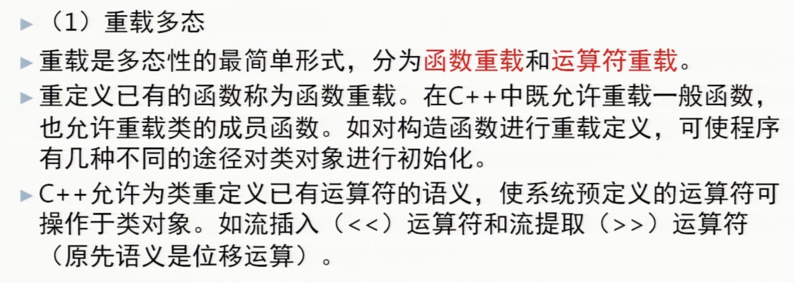
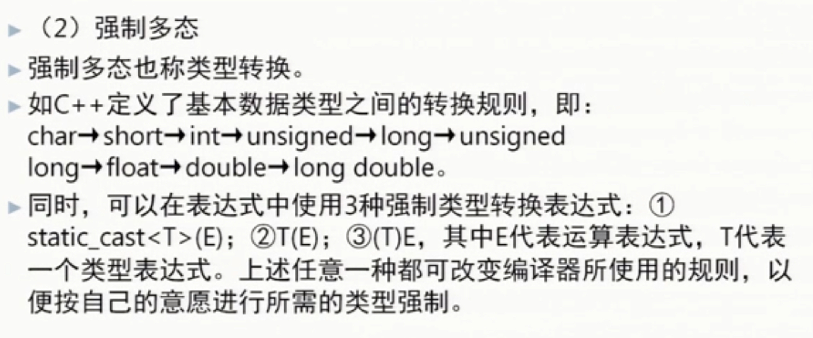
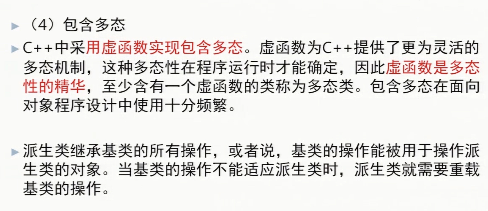

# 多态性

## 多态性的概念

多态是指同样的消息被不同类型的对象接收时导致不同的行为。所谓的消息是指对类成员函数的调用，不同的行为是指不同的实现，也就是调用了不同的函数。

从广义上说，多态性是指一段程序能够处理多种类型对象的能力。

在C++中，这种多态性可以通过重载多态(函数和运算符重载)、强制多态(类型强制转换)、类型参数化多态(模版)、包含多态(继承及虚函数)四种形式来实现。  

### 重载多态

### 强制多态

### 类型参数化多态

### 包含多态
