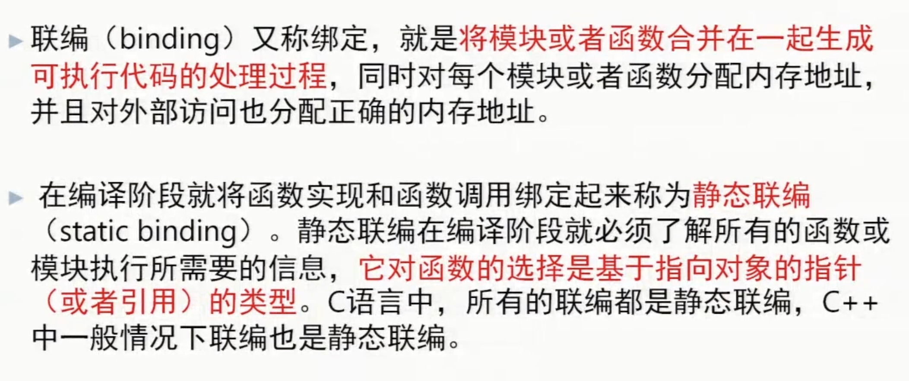
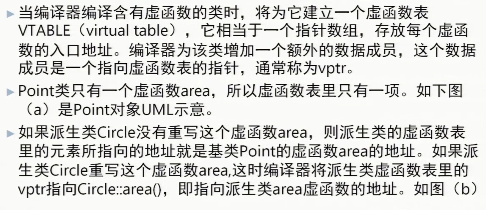
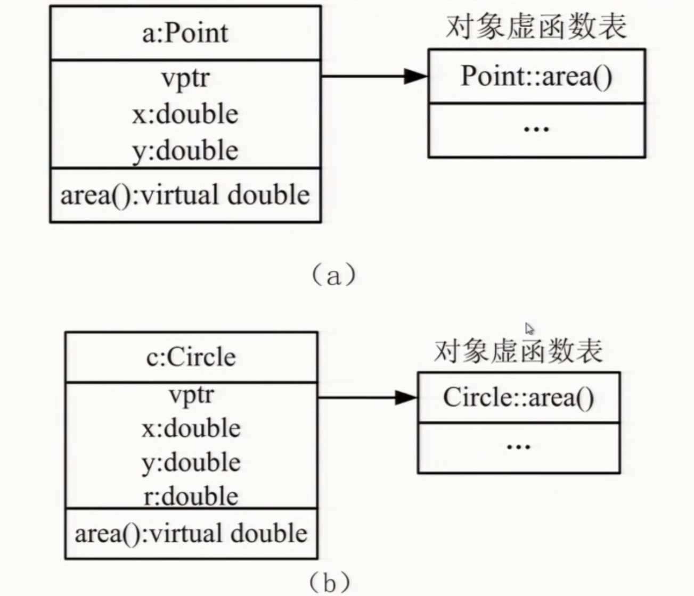

# 静态联编


```cpp
class A{
public: void f(){ cout<<"classA::f()\n"; }
};
class B:public A{
public: void f(){ cout<<"classB::f()\n"; }
};
int main( ){
A t1,*p; B t2;
t1.f(); 
t2.f(); 
p=&t1; p->f(); 
p=&t2; p->f(); 
return 0;
}

//程序运行结果
classA：：f()
classB：：f()
classA：：f()
classA：：f()

```

# 动态联编

```cpp
class Base{
public:virtual void f(){ cout<<“Base ::f \n”; }
};
class Derived:public Base{
public:void f(){ cout<<"Derived ::f \n"; }
};
void fa(Base *p){ p->f();}
void fb(Base &t){ t.f();}
int main( ){   Base t1;     Derived t2;
fa(&t1);  fa(&t2);  fb(t1);  fb(t2); 
return 0;
}


//程序运行结果
Base::f
Derived::f
Base::f
Derived::f

```





虚函数的调用规则是：根据当前对象，优先调用对象本身的虚成员函数。这和名字支配规则规律类似，不过虚函数是动态联编的，是在运行时(通过虚函数表中的函数地址)间接调用实际上想要联编的函数。