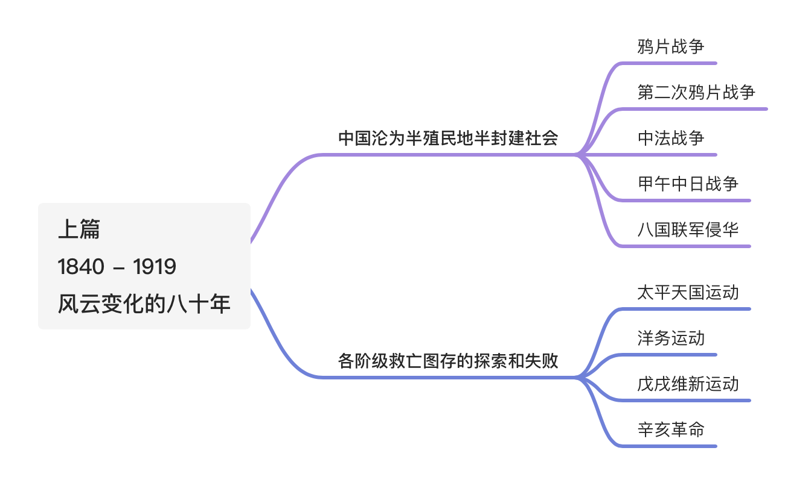
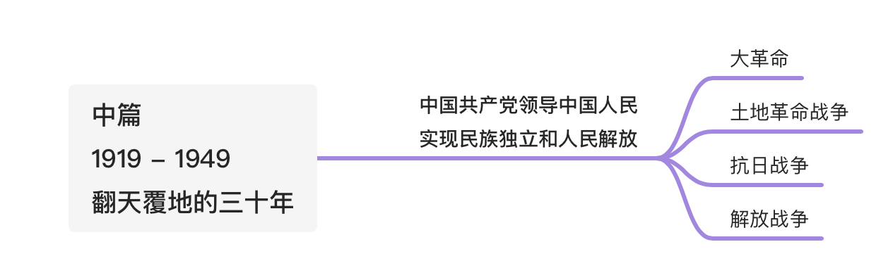
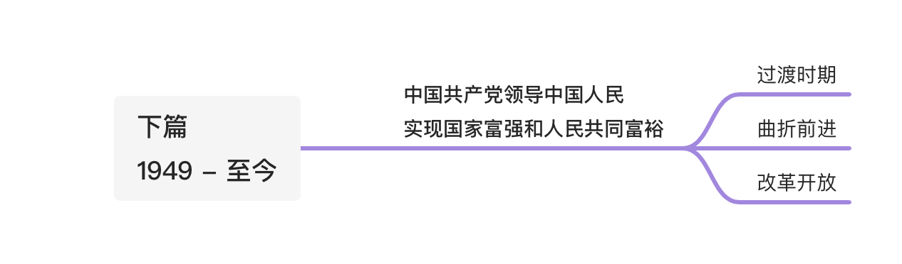

# 目录

>第一章 进入近代后中华民族的磨难与抗争
第二章 不同社会力量对国家出路的早起探索
第三章 辛亥革命与君主专制制度的终结
第四章 中国共产党成立和中国革命新局面
第五章 中国革命的新道路
第六章 中华民族的抗日战争
第七章 为建立新中国而奋斗
第八章 中华人民共和国的成立与中国社会主义建设道路的探索
第九章 改革开放与中国特色社会主义的开创和发展
第十章 中国特色社会主义进入新时代

## 整体划分  

### 上篇

### 中篇

### 下篇

