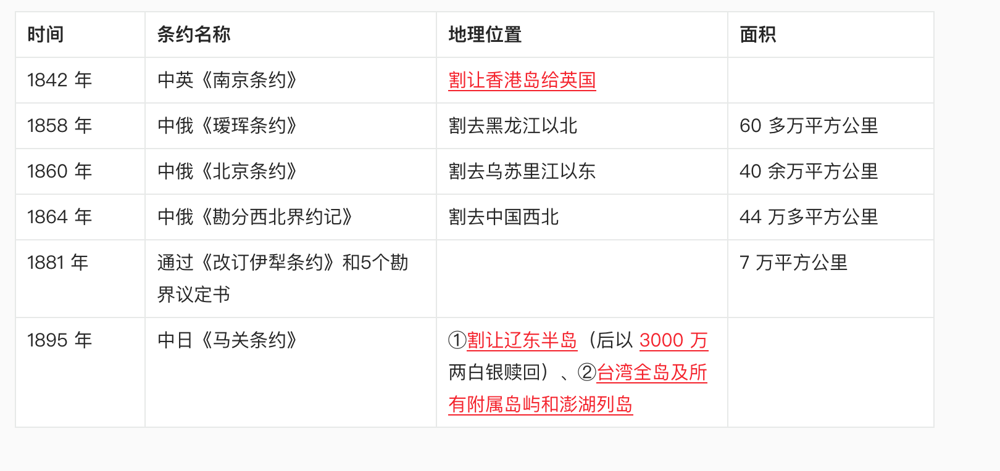

# 第一章 进入近代后中华民族的磨难与抗争  

## 第一节 鸦片战争前后的中国和世界

### 一、中国封建社会的衰弱

#### （一）中国封建社会的基本特点

>1. 中国封建社会的基本特点  
  ○ 经济上，封建土地所有制占主导地位。  
  ○ 政治上，实行高度中央集权的封建君主专制制度。
  ○ 文化上，以儒家思想为核心。  
  ○ 社会结构上，形成族权和政权相结合的封建宗法等级制度。核心是宗族家长制，君权、父权、夫权占主导地位。  
>2. 综上所述，封建社会的主要矛盾，是地主阶级和农民阶级的矛盾。

#### （二）中国封建社会末期的社会危机

乾隆朝后期，清王朝由强盛转向衰落。

### 二、世界资本主义的发展与殖民扩张

#### （一）西方资本主义制度的确立

1640 年，英国爆发资产阶级革命。至 18 世纪，资本主义制度在英国、美国、法国等欧美主要国家先后确立。

#### （二）西方列强的殖民扩张

（殖民主义是适应西方资本主义的发展要求而产生的）
开辟新的市场和转移国内矛盾的需要，促使西方列强发动新的侵略战争，他们把目标瞄向中国。1825 年，英国经历第一次资本主义经济危机。

### 三.鸦片战争的爆发

#### （一）鸦片战争

中国的封建社会逐渐变成了半殖民半封建社会  
鸦片战争成为中国近代史的起点

#### （二）近代中国社会的半殖民半封建性质

P19-20
提出了两个问题

1. 为什么说独立的中国逐步变成了半殖民地的中国？
2. 为什么说封建的中国逐步变成了半封建的中国？

<mark>中国半殖民半封建社会的基本特征</mark>

1. 1840 年鸦片战争是中国近代史的开端
2. 近代中国半殖民地半封建社会的特点（问答题）
  a. 资本-帝国主义控制了中国的政治，成为了支配中国的决定性力量。
  b. 封建势力同外国侵略势力相勾结
  c. 原来的自给自足的经济虽然被破坏了，但还是广泛的存在着。
  d. 新的民族资本主义经济已经产生，但是发展缓慢。
  e. 各地区的发展极不平衡
  f. 中国人民群众生活日益贫困

#### （三）近代中国社会阶级关系的变动

1. 中国资产阶级分为官僚买办资产阶级和民族资产阶级
2. 中国工人阶级的特点（问答题）
  a. 革命性最强  
  b. 分布集中，便于形成革命的力量和传播先进的思想。  
  c. 与农民有天然联系，便于组成工农联盟。  

#### （四）近代中国的社会主要矛盾和两大历史任务

<mark>两对主要矛盾和两大历史任务</mark>
（一）两对主要矛盾及其关系（重点）

1. 帝国主义和中华民族的矛盾和封建主义和人民大众的矛盾。是占支配地位的主要的矛盾
2. 帝国主义和中华民族的矛盾是最主要的矛盾
3. 近代中国社会的主要矛盾及其影响。（问答题）
  a. 矛盾是帝国主义和中华民族的矛盾，封建主义和人民大众的矛盾。
  b. 影响是为了解决这些矛盾，推动了中国社会的进步。
（二）两大历史任务及其关系（问答题）
一是求得民族独立和人民解放；二是实现国家繁荣富强和人民共同富裕。

## 第二节 西方列强对中国的侵略  

### 一.军事侵略

1. 资本-帝国主义对列强对中国的侵略，首先主要的是进行军事侵略。
2. 通过不平等条约，资本-帝国主义国家侵占中国大片领土

3. 1860 年 10 月，英法朕军攻占北京城后，抢劫和焚烧了清朝皇帝的离宫圆明园。

### 二.政治控制

1. 控制中国的内政，外交
2. 镇压中国人民的反抗
3. 扶植，收买代理人

《天津条约》的一项重要内容，中国政府允许外国公使常驻北京。

### 三.经济掠夺

1. 控制中国的通商口岸
2. 剥夺中国的关税自主权
3. 实行商品倾销和资本输出
4. 操纵中国的经济命脉

### 四.文化渗透

1. 披着宗教外衣，进行侵略活动
2. 为侵略中国制造舆论

广学会发行了《万国公报》

## 第三节 反抗外国武装侵略的斗争  

### 一、抵御外来侵略的斗争历程

#### 人民群众的反侵略斗争和爱国官兵的反侵略斗争

1841 年 5 月，三元里人民在广州北郊英勇抗击英国侵略军，成为近代中国人民第一次大规模的反侵略武装斗争。
2. 爱国官兵的反侵略斗争
3. 鸦片战争：广东水师关天培战死虎门；江南提督陈化成在吴淞牺牲；副都统海龄在镇江牺牲。
4. 中法战争：刘铭传击退法舰。冯子材率领清军和当地民众取得镇南关大捷。
5. 中日甲午战争：左宝贵战死平壤；邓世昌、林永升在黄海海战中牺牲；丁汝昌、刘步蟾在威海卫以身殉国。

### 二、义和团运动与列强瓜分中国图谋的破产

#### （一）边疆危机和瓜分危机

1. 英国从印度侵入西藏，又从缅甸入侵云南。法国则从越南侵犯广西。俄国从中亚入侵新疆。日本吞并琉球、侵犯中国台湾。
2. 美国于 1899 年 9 月至 11 月间照会各国，提出了“门户开放”政策。
3. 
#### （二）列强瓜分中国图谋的破产

列强并没有实现瓜分中国的图谋，其原因何在? （问答题）

   1. 帝国主义列强之间的矛盾和互相制约（重要原因）
   2. 中华民族进行的不屈不挠的反侵略斗争（根本原因）

## 第四节 反侵略战争的失败与民族意识到觉醒

### 一.反侵略斗争的失败和民族意识的觉醒

（一）反侵略斗争的失败及其原因（问答题）

   1. 社会制度的腐败（最根本的原因），清政府为了自己的利益卖国求荣。
   2. 经济技术的落后，武器装备都是冷兵器，没有实力跟西方列强抗衡，单兵素质差。

（二）民族意识的觉醒

   1. 林则徐是中国近代史上“睁眼看世界”的第一人，他编写了《四洲志》。
   2. 魏源在《四洲志》的基础上，完成了《海国图志》一书，明确提出了“师夷长技以制夷”的思想,
   3. 中日甲午战争以后，当中华民族面临生死存亡的关头时，中国人才开始有了普遍的民族意识的觉醒。
   4. 严复翻译了《天演论》。他用“物竞天择”、 “适者生存”的社会进化论思想，为这种危机意识和民族意识提供了理论根据。
   5. 孙中山 1894 年 11 月在创立革命团体兴中会时，喊出了“振兴中华”这个时代的最强音。

民族危机激发了中华民族的觉醒，也增强了中华民族的凝聚力

中国近代史，是一部充满磨难，落后挨打的悲惨屈辱史，更是一部中华名族抵抗外来侵略，实现民族独立的伟大斗争史。近代以来，中国人民和志士仁人怀着强烈的忧患意识和变革意识，历尽千辛万苦，不怕流血牺牲，探索挽救中华民族危亡，实现民族复兴的道路。这些斗争和探索，使中华民族燃起了新的希望，标志着中华民族日益觉醒

## 学习思考

1. 为什么说鸦片战争是中国近代史的起点？
第一、战争后中国的社会性质发生了根本性变化，由一个落后封闭但独立自主的封建国家沦为一个半殖民地半封建社会。
第二、中国的发展方向发生变化，战前中国是一个没落的封建大国，封建制度已经腐朽，在缓慢地向资本主义社会发展，如果没有外来势力干扰，中国最终也会向西方大国那样发生资产阶级革命成为资本主义国家；而鸦片战争后中国的民族资本主义不可能获得正常发展，中国也就不可能发展为成熟的资本主义社会，而最终选择了社会主义道路。
第三、社会主要矛盾发生变化，战前中国的主要矛盾是农民阶级与封建地主阶级的矛盾，而战后主要矛盾则包括农民阶级和地主阶级的矛盾及中华民族与资本帝国主义的矛盾，也就是社会主要矛盾复杂化。
第四、是革命任务发生变化，原先的革命任务是反对本国封建势力，战后则增加了反对外国殖民侵略的任务，革命的性质也由传统的农民战争转为旧民族主义革命。

2. 资本-帝国主义的入侵给中国带来了什么？
第一,军事侵略。资本一帝国主义列强对中国的侵略,首先和主要的是进行军事侵略,迫使中国政府签订不平等条约。发动侵略战争,屠杀中国人民;侵占中国领土,划分势力范围;勒索赔款,抢劫财富。
第二,政治控制。为了统治中国,帝国主义列强在政治上采取的主要方式,是控制中国政府,操纵中国的内政、外交,把中国当权者变成自己的代理人和驯服工具。资本一帝国主义列强通过军事侵略和不平等条约,控制中国的内政、外交,享有领事裁判权,把持中国海关,镇压中国人民的反抗,扶植、收买代理人。
第三,经济掠夺。外国列强控制中国通商口岸、剥夺中国关税自主权、对华倾销商品和资本输出,并逐渐操纵中国经济命脉。
第四,文化渗透。外国列强利用宗教进行侵略活动,鼓吹侵略有功论、“种族优劣论”,为侵华制造舆论。所以,资本一帝国主义对中国的侵略和本国封建势力对人民的压迫,是近代中国落后、贫困的根本原因。虽然,列强在侵华的时候也充当了历史的不自觉的工具,把西方资本主义的机器技术带入中国,刺激了中国资本主义的发生。但是,其主观上并不希望中国成为独立自主富强的近代化国家,因此总是千方百计地压制中国民族资本主义的发展,阻挠和破坏中国社会的进步。历史证明,只有推翻帝国主义和封建主义在中国的统治,中国才有可能走上独立富强的道路。

3. 反对外国侵略的斗争具有什么意义？
1、近代中国人民进行的反侵略战争，教育了中国人民，振奋了中华民族的民族精神，鼓舞了人民反帝反封建的斗志，大大提高了中国人民的民族觉醒意识。  
2、近代中国人民进行的反侵略战争，沉重打击了帝国主义侵华的野心，粉碎了他们瓜分中国和把中国变成完全殖民地的图谋。  
3、增强了中华民族整体民族利益休戚与共的民族认同感和凝聚力，成为中华民族自立自强并永远立于世界民族之林的根本所在。  

4. 反侵略斗争失败的根本原因和教训是什么？
   (1)中国近代历史反侵略战争失败的根本原因。
第一,近代中国社会政治制度的腐败和清政府的腐朽无能,是反侵略战争失败的根本原因。主要表现在:统治中国的清王朝从皇帝到权贵,大都昏庸愚味,专制腐败,敌视人民,妥协求和。
第二,经济和科学技术的落后是重要原因。不仅是武器的落后,而且是国家综合实力和军事作战能力的落后。
(2)近代中国反侵略战争失败的历史教训。
第一,在近代中国,为了反对外国侵略、争得民族独立,必须充分动员和组织人民群众的力量,必须改变帝国主义、封建主义联合统治的半殖民地半封建的社会制度。
第二,要取得反侵略战争的胜利,必须改变中国经济技术落后的状况。需要在科学技术方面奋起直追,需要进行现代化建设。但现代化建设的前提是民族独立和人民解放,不推翻帝国主义对中国的民族压迫,就没有进行现代化的前提和条件,难以使国家真正强大起来。

