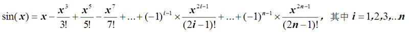

#### 链接
https://www.educoder.net/tasks/ZA7G2JBF/1247011/nqml5jwso8it?coursesId=ZA7G2JBF

# 第一关
## 实验内容
> 本关任务：程序定义类MyClassA及其派生类MyClassB，以及主函数main，用以统计数组中奇数元素的个数。

## 算法提示
>若类MyClassA中元素的值为奇数，则类MyClassB中对应元素的值为1；若类MyClassA中元素的值不是奇数，则类MyClassB中对应元素的值为0。类MyClassB中所有元素的和就是类MyClassA中奇元素的个数，如下所示：
MyClassA::arr：3  0  1  4  7  5  2  9  6  8
MyClassB::arr：1  0  1  0  1  1  0  1  0  0
奇数元素个数： 1+0+1+0+1+1+0+1+0+0=5

## 程序
```cpp
#include<iostream>
#include<cstring>
using namespace std;

class MyClassA{
public:
	MyClassA(int *p,int n):length(n)
	{
		int i;
		//ERROR**********found**********
		arr=new int[length];        //数组的动态空间
		for(i=0;i<length;i++)
			arr[i]=p[i];
	}
	int GetI(int i)const{ return arr[i];}
	int GetLength()const{ return length;}
	~MyClassA(){ delete []arr; }
protected:
	int *arr;			// 数组
	int length;			// 元素个数
};

//ERROR**********found**********
class MyClassB: public MyClassA{        //公有继承
public:
	MyClassB(int *p,int n);
	int GetI(int i)const;
	void count();		// 设置元素标记
	~MyClassB();
private:
	int *arr;			// 元素标记，1表示是奇数，0表示不是奇数
};
MyClassB::MyClassB(int *p,int n):MyClassA(p,n)
{
	arr=new int[length];
}
int MyClassB::GetI(int i)const{ return arr[i];}
void MyClassB::count()
{
	int i;
	for(i=0;i<length;i++)
		if(MyClassA::arr[i]%2==1)arr[i]=1;
		else arr[i]=0;
}
MyClassB::~MyClassB()        //析构函数
{
	//ERROR**********found**********
	delete  [] arr;            //释放动态内存
}

int main()
{
	int t[10]={3,0,1,4,7,5,2,9,6,8},i,s=0;
	MyClassB test(t,10);
	test.count();
    cout<<"数组为：";
	for(i=0;i<test.MyClassA::GetLength();i++){
		//ERROR**********found**********
		cout<<test.MyClassA::GetI(i)<<'\t';        //类的作用域
		s+=test.GetI(i);
	}
	cout<<endl;
	cout<<"奇数个数是：";
	cout<<s<<endl;
	system("pause");
	return 0;
}
```

# 第二关  
## 实验目的
>- 1、进一步掌握派生类的定义和对象使用的方法。  
>- 2、进一步掌握派生类构造函数说明和定义的方法。  
>- 3、进一步掌握指针（字符数组）的使用。  
>- 4、培养针对派生类的程序设计能力。  

## 实验内容  
>本关任务：程序定义了类Dates（“日期”）及其派生类Plants（“植物”），以及主函数main。在主函数中定义了二个植物类的对象，实现其开花时间的比较。

## 算法提示  
开花时间（日期）的比较是对象的比较，对象的运算通常是通过对象成员（基本变量）的运算实现的，具体为：  
1、首先比较年份的前后。  
2、若年份相同，再比较月份。  
3、若月份还相同，最后比较日。  

## 程序
```cpp
#include<iostream>
#include<cstring>
using namespace std;

class Dates{
public:
	Dates(int y=0,int m=0,int d=0):year(y),month(m),day(d){ }
	~Dates(){ }
	int GetYear(){return year;}
	int GetMonth(){return month;}
	int GetDay(){return day;}
private:
	//**********found**********
	int year;  
	int month;
	int day; 
};

//**********found**********
class Plants:public Dates  {
public:
	Plants(char*n,int y=0,int m=0,int d=0);
	~Plants();
	char*GetName();
private:
	char *name;				// 植物名称
};
//**********found**********
Plants::Plants(char*n,int y,int m,int d):  Dates(y, m, d)
{
	int length;
	length=strlen(n);
	name=new char[length+1];
	strcpy(name,n);
}
Plants::~Plants()
{
	delete []name;
}
char* Plants::GetName()
{
	return name ;
}

bool IsEqual(Plants &pa,Plants &pb) // 判断pa和pb开花日期是否相同，是返回真，否则返回假
{
	if(pa.GetYear()==pb.GetYear())
		//**********found**********
		if( pa.GetMonth() == pb.GetMonth() )
			if(pa.GetDay()==pb.GetDay())return true;
	return false;
}

int main()
{
	Plants plantA("桃",2020,3,10);
	Plants plantB("杏",2020,4,5);
	cout<<plantA.GetName()<<"开花时间是："<<plantA.GetYear()<<'-'<<plantA.GetMonth()<<'-'<<plantA.GetDay()<<endl;
	cout<<plantB.GetName()<<"开花时间是："<<plantB.GetYear()<<'-'<<plantB.GetMonth()<<'-'<<plantB.GetDay()<<endl;
	if(IsEqual(plantA,plantB))
		cout<<plantA.GetName()<<"和"<<plantB.GetName()<<"在同一天开花。"<<endl;
	else cout<<plantA.GetName()<<"和"<<plantB.GetName()<<"不在同一天开花。"<<endl;
	system("pause");
	return 0;
}
```

# 第三关

## 实验内容
>本关任务：程序包含了3个文件，分别是头文件“Graphics.h”、 源程序文件“Graphics.cpp”和源程序文件“main.cpp”。在头文件“Graphics.h”中声明了一个抽象图形类Graphics、三角形类Triangle和矩形类Rectangle，用于生成所需三角形和矩形。

## 算法提示
1、运行多态性的方法
（1）具有继承关系的类。  
（2）基类有虚函数，且派生类中重新定义虚函数。  
（3）通过基类指针或基类对象的引用调用虚函数。  
2、输出矩形的方法  
把矩形看成一个矩阵，矩阵的外围（第1行和最后1行、第1列和最后1列）输出星号，其他输出空格字符。
3、输出三角形的方法  
输出三角形的可用下列2种方法实现：  
（1）每行先输出一组空格字符，再输出一组星号。每行空格字符和星号的数量与行号相关，需找出其对应关系。总行数与图形的大小（尺寸），需找出其对应关系。  
（2）把矩形也看成一个矩阵，矩阵中特定位置的元素输出星号，其他输出空格字符。需找出矩阵中特定位置与行号之间的关系，即列满足特定条件时输出星号。  
```cpp
#include"Graphics.h"
//#pragma warning(disable:4996)

Graphics::Graphics(int n):size(n)
{
}

Triangle::Triangle(int n):Graphics(n)
{
}
void Triangle::construction()
{
	cout<<"三角形为："<<endl;
	int i,j;
	//**********begin**********
	for ( i = 1; i <= size-4; i++) {
        for ( j = 1; j <= size - i - 4; j++) {
            cout << "  ";  // 输出空格
        }
        for ( j = 1; j <= 2 * (i-1) + 1; j++) {
            cout << "* ";
        }
        cout << endl;
	
	//**********end**********
}
}
Rectangle::Rectangle(int n):Graphics(n)
{
}
void Rectangle::construction()
{
	cout<<"矩形为："<<endl;
	int i,j;
	for(i=0;i<size;i++){
		for(j=0;j<size;j++)
			if(i==0||i==size-1||j==0||j==size-1)	// 输出边界的*
				cout<<'*'<<' ';					// 输出内部空格
			else cout<<' '<<' ';
		cout<<endl;
	}
    cout<<"END.";
}
```
```cpp
#include<iostream>
using namespace std;

class Graphics{
public:
	Graphics(int n);					// 用参数初始化数据成员size
	virtual void construction()=0;		// 生成大小为size的图形
protected:
	int size;						// 图形的大小
};

class Triangle:public Graphics{			// 三角形
public:
	Triangle(int n);
	void construction();
};

class Rectangle:public Graphics{		// 矩形
public:
	Rectangle(int n);
	void construction();
};
//void writeToFile(const string);			// 不用考虑此语句的作用
```
```cpp
#include"Graphics.h"

void fun(Graphics * p)
{
	p->construction();
}

int main()
{
	Triangle t(9);
	fun(&t);
	Rectangle r(9);
	fun(&r);
	system("pause");
	return 0;
}
```
 
# 第四关  求三角函数的值

本关任务：设计一个程序求三角函数的值，具体要求如下：  
（1）定义类Trigonometric作为基类，包含：  
①保护数据成员
    double arc;             // 弧度
    double value;          // 三角函数值
②公有构造函数Trigonometric(double t); // 用度数t初始化弧度arc，并置value为0；  
（2）定义类Trigonometric的公有派生类Sine，求正弦值。新增如下公有成员函数：  
   构造函数;  
   double f1(double x,int n) ;  // 求 x的n次方    
   double f2(int n) ;             // 求n !  
   void function();             // 求正弦值，公式为：
  正弦 
要求精度达到最后一项的值小于 10-6 。  
   void show();         // 按指定格式输出数据成员
（3）在主函数中对定义的类进行测试。  
```cpp
#include<iostream>
#include<cmath>
using namespace std;

const double PI=3.14159;
class Trigonometric {
protected:
    double arc; // 弧度
    double value; // 三角函数值
public:
    Trigonometric(double t) : value(0) 
    {
      while (t>360)
      {
        t-=360;
      }
      arc=t * PI / 180 ;
    }
};

class Sine : public Trigonometric {
public:
    Sine(double t) : Trigonometric(t) {} 

    double f1(double x, int n) {
        double result = 1;
        for (int i = 0; i < n; ++i) {
            result *= x;
        }
        return result;
    }

    int f2(int n) {
        if (n == 0 || n == 1) {
            return 1;
        } else {
            return n * f2(n - 1);
        }
    }

    void function() {
        double t = 0;
        double x = arc;
        for (int n = 1, k = 1; ; n += 2, k *= -1) {
             t = k * f1(x, n) / f2(n);
            if (abs(t) < 1e-6)         ////abs()函数返回x的绝对值，即| x |
            {
                break;
            }
            value += t;
        }
    }

    void show() {
        cout << "sin(" << arc << ")=" << value << endl;
    }
};

int main()
{
    double d;
    cout<<"请输入度数：";
    cin>>d;
    Sine sin(d);
    sin.function();
    sin.show();
    return 0;
}
```

### 类外定义
```cpp
#include<iostream>
#include<cmath>
using namespace std;
const double PI=3.14159;
class Trigonometric{
    protected:
    double arc;             // 弧度
    double value;          // 三角函数值
    public:
    Trigonometric(double t); // 用度数t初始化弧度arc，并置value为0；

};

class Sine:public Trigonometric{
    public:
    Sine(double t) : Trigonometric(t) {} 
    double f1(double x,int n) ;  // 求 x的n次方 
   double f2(int n) ;             // 求n !
   void function();             // 求正弦值，公式为
    void show();         // 按指定格式输出数据成员
};
Trigonometric::Trigonometric(double t):value(0)//value 用度数t初始化弧度arc，并置value为0；
    {  while (t>360)
      {
        t-=360;
      }
      arc=t * PI / 180 ;
    }
double Sine::f1(double x,int n) 
{
    double t=1;
    for(int i=0;i<n;i++)
    {
        t*=x;
    }
    return t;
}

double Sine::f2(int n)
 {
   if (n == 0 || n == 1)  return 1;
        
   else  return n * f2(n - 1);
        
 }

   void Sine::function()            // 求正弦值，公式为
    {
        double t = 0;
        double x = arc;
        for (int n = 1, k = 1; ; n += 2, k *= -1) {
             t = k * f1(x, n) / f2(n);
            if (abs(t) < 1e-6)              //abs()函数返回x的绝对值，即| x |
            {
                break;
            }
            value += t;
        }
    }
void Sine::show() {
        cout << "sin(" << arc << ")=" << value << endl;
    }

int main()
{
    double d;
    cout<<"请输入度数：";
    cin>>d;
    Sine sin(d);
    sin.function();
    sin.show();
    return 0;
}
```