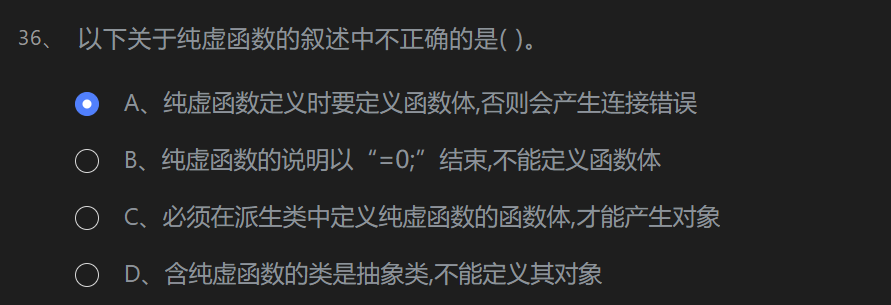

# 第一关

## 答案
<mark> BBADC BBCBD CDCDD DABBD DDCAA DCBDC CDADB CBCBD D </mark>

>13、  
关于变量的存储类型,下列说法错误的是( C )。    
A、函数形参默认为是自动变量  
B、全局变量默认为是静态变量  
C、局部变量没有缺省值  
D、静态变量具有缺省值0  
<mark>缺省值是随机的</mark>  

16、  
设有说明语句如下:  
double a[]={1,3,5,7,9};  
则下列表达式的值不为1的是( D )。  
A、*a  
B、&a[3]-&a[2]  
C、a[0]  
D、*(&a)  
<mark>a本身就是地址，由于两个数组元素的地址相减，其值并不是等于两个地址数值上的差，而是等于这两个地址之间内存单元的个数。  
D输出的就是元素的地址<<endl;

>20.下列动态空间的分配中,不正确的是( )。  
A、  
double * p1 = new double;
B、  
float * p2 = new float(3);
C、  
int n=5, * p3 = new int[n];
D、  
char * p4 = new char("abcd") ;  
<mark>在动态空间的分配中，char * p4 = new char("abcd")是不正确的。正确的写法应该是：char * p4 = new char[5]，使用方括号来分配一定数量的内存空间，而不是使用括号。</mark>

>22、
关于类的构造函数,下列说法不正确的是( D )。  
A、每个类都有构造函数  
B、编写程序时,可以不为类定义构造函数   
C、为了初始化类的数据成员,通常需要定义构造函数  
D、每个类均有且只有一个缺省的构造函数  
<mark>分析如下：  
A、每个类都有构造函数：正确，每个类都至少有一个构造函数。  
B、编写程序时，可以不为类定义构造函数：正确，如果没有显式定义构造函数，编译器会提供默认的构造函数。  
C、为了初始化类的数据成员，通常需要定义构造函数：正确，构造函数用于初始化类的数据成员。  
D、每个类均有且只有一个缺省的构造函数：不正确，如果没有显式定义构造函数，编译器会生成默认构造函数。但是如果类包含了其他特殊的构造函数（拷贝构造函数、带参数的构造函数等），那么默认构造函数就不再是唯一的了。  
所以，不正确的说法是 D、每个类均有且只有一个缺省的构造函数。</mark>  

>26、  
关于类的静态数据成员,下列叙述正确的是( D )。  
A、静态数据成员不可以在类的构造函数中赋值  
B、静态数据成员不可以被类的对象调用  
C、静态数据成员不受类的访问权的限制  
D、静态数据成员可以通过类名调用  

>27、  
关于常对象和常成员,下列叙述错误的是( C )。  
A、常成员函数既能访问常成员数据,也能访问非常成员数据  
B、非常成员函数既能访问非常成员数据,也能访问常成员数据  
C、常对象既能访问常成员函数,也能访问非常成员函数  
D、非常对象既能访问非常成员函数,也能访问常成员函数  

>34、
下列关于虚函数的描述中正确的是( )。  
A、可以把静态的成员函数说明为虚函数  
B、可以把非成员函数说明为虚函数  
C、可以把构造函数和析构函数说明为虚函数  
D、基类中的虚函数继承到派生类中,即使不用virtual说明仍为虚函数  
>

>38、
下面关于运算符重载的描述错误的是( )。  
A、运算符重载不能改变操作数的个数、运算符的优先级和结合性  
B、不是所有的运算符都可以重载  
C、运算符重载函数的调用必须使用关键字operator  
D、在C++语言中不可通过运算符重载创造出新的运算符  
><mark>调用不一定要使用</mark>

# 第二关  

## 答案 BBBBD DCCDC AACBD ADCAB CCCBC DBDDC DCABC ABACB D

26
关于类的静态成员,下列叙述错误的是( D )。  
A、可以通过类名和作用域运用符使用类的静态成员  
B、可以通过对象名和成员运用符使用类的静态成员  
C、类的静态成员函数不能直接使用类的非静态成员  
D、在声明对象前系统不为类的任何数据成员分配存储空间  
<mark>静态成员会分配内存空间</mark>

>32
关于派生冲突及解决方法,下列说法错误的是( C )。
A、来自不同类的同名成员,可用类名和作用域运算符进行区分
B、解决派生类中出现基类成员多个拷贝的方法是把基类声明为虚基类
**C、用关键字virtual声明的虚函数不会出现同名冲突**  
D、派生成员和新增成员同名时,派生类中默认引用的是新增成员

# 第三关 

## 答案 

<mark> CBBBB CBCDD BBCAC DAADC ADCCA ADCCA BBCBC ABDCB AD

# 第四关 

## 答案 
ABDCC DBBBC DABBD CBDDC CACCA CBCBB CACCB ACCBC

# 第五关

## 答案
AAADC CBCAD CDBCB BACCA BBCBC DCDDA ACDBC CBCBC

# 第六关

## 答案

ADCDA CACCD CDBCC AACBB CCDAB CACDB ADDDD DAACC

